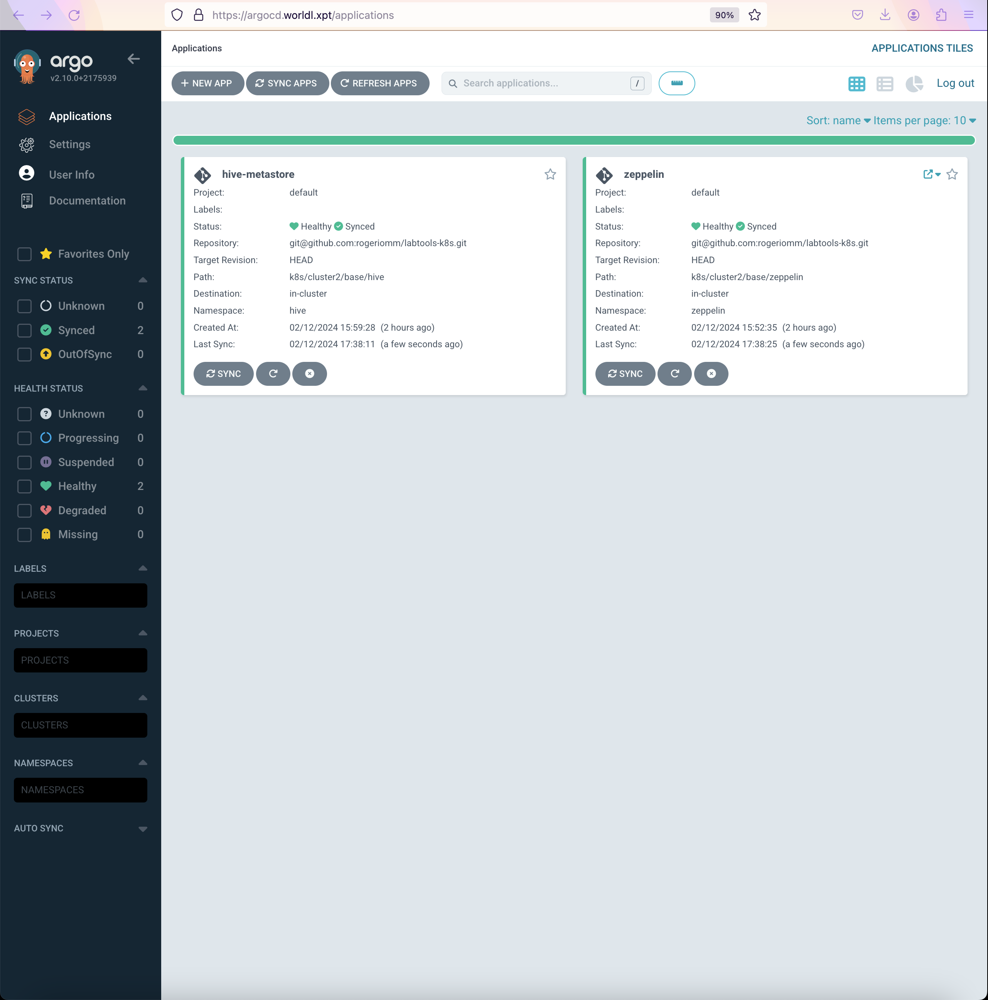

**This is a work in progress...**

   * [Jupyter notebooks](https://github.com/rogeriomm/lab-k8s-notebooks/tree/master/jupyter-notebooks/)
      * [Quick start](https://github.com/rogeriomm/lab-k8s-notebooks/tree/master/jupyter-notebooks/quick-start) 
        * [Kafka](https://github.com/rogeriomm/lab-k8s-notebooks/tree/master/jupyter-notebooks/quick-start/kafka) 
   * [Zeppelin notebooks (TODO)](https://github.com/rogeriomm/lab-k8s-notebooks/tree/master/zeppelin-notebooks/)

   * TODO
      * [AWS EKS](https://aws.amazon.com/eks/) + Terraform 
        * Staging environment with production-like characteristics

# Pipeline architecture

   * [CDC replication on Delta lake(TODO)](https://github.com/rogeriomm/debezium-cdc-replication-delta)

# Kafka Strimzi, Debezium CDC AVRO, Confluent Schema Registry, Postgres/SQL Server
## Postgres
   * [YAML](k8s/cluster2/base/kafka/main)   -  [Notebook](https://github.com/rogeriomm/labtools-k8s-notebooks/blob/master/jupyter-notebooks/quick-start/kafka/DebeziumPostgresCdc.ipynb)

##  Microsoft SQL Server CDC
* [YAML](k8s/cluster2/helm/sqlserver) [Notebook](https://github.com/rogeriomm/labtools-k8s-notebooks/blob/master/jupyter-notebooks/quick-start/sqlserver/sqlserver.ipynb) [Notebook CDC](https://github.com/rogeriomm/labtools-k8s-notebooks/blob/master/jupyter-notebooks/quick-start/kafka/DebeziumSqlserverCdc.ipynb)

# Zeppelin/Jupyter
   * [YAML](k8s/cluster2/base/zeppelin)

   * [YAML](k8s/cluster2/base/jupyter)

# Spark

# Metabase

# Datahub

# OpenMetadata

# Airflow

# Minio

# Argo CD

# Kubernetes

   * [Notebook](https://github.com/rogeriomm/labtools-k8s-notebooks/blob/master/jupyter-notebooks/quick-start/minikube/minikube.ipynb)

# Web local
| Local URL                                            | Description                                                                                                                | User    | Password                                                                                                                                |
|------------------------------------------------------|----------------------------------------------------------------------------------------------------------------------------|---------|-----------------------------------------------------------------------------------------------------------------------------------------|
| https://dashboard.worldl.xpt/                        | [K8S dashboard](https://kubernetes.io/docs/tasks/access-application-cluster/web-ui-dashboard/)                             |         |                                                                                                                                         |
| https://argocd.worldl.xpt                            | [ArgoCD](https://argoproj.github.io/cd/)                                                                                   | admin   | [Notebook](https://github.com/rogeriomm/labtools-k8s-notebooks/blob/master/jupyter-notebooks/quick-start/argocd/admin-password.ipynb)   |
| https://zeppelin.worldl.xpt                          | [Zeppelin](https://zeppelin.apache.org/)                                                                                   |         |                                                                                                                                         |
| https://jupyter.worldl.xpt/jupyter                   | [Jupyter](https://jupyter.org/) notebook: Python,Scala, RUST                                                               |         |                                                                                                                                         |
| https://jupyter-commander.worldl.xpt/jupyter         | [Jupyter](https://jupyter.org/) notebook: Python,Scala, RUST - K8S Admin Service Account                                   |         |                                                                                                                                         |
| https://minio-console.worldl.xpt                     | [MINIO operator](https://github.com/minio/operator/)  instance minio-tenant-1                                              | minio   | awesomes3                                                                                                                               |
| https://console.minio-operator.svc.cluster2.xpt:9090 | [MINIO operator](https://github.com/minio/operator/)                                                                       |         |                                                                                                                                         |
| https://airflow.worldl.xpt/flower/                   | [Airflow flower](https://airflow.apache.org/docs/apache-airflow/stable/administration-and-deployment/security/flower.html) | admin   | admin                                                                                                                                   |
| https://airflow.worldl.xpt/airflow                   | [Airflow](https://airflow.apache.org/docs/apache-airflow/stable/index.html)                                                |         |                                                                                                                                         |
| https://jupyter-glue2.worldl.xpt/                    | [AWS Glue version 2.0 - Jupyter](https://docs.aws.amazon.com/glue/latest/dg/aws-glue-programming-etl-libraries.html)       |         |                                                                                                                                         |
| https://webui-glue2.worldl.xpt/                      | [AWS Glue version 2.0 - WebUI](https://docs.aws.amazon.com/glue/latest/dg/aws-glue-programming-etl-libraries.html)         |         |                                                                                                                                         |
| https://history-glue2.worldl.xpt/                    | [AWS Glue version 2.0 - History](https://docs.aws.amazon.com/glue/latest/dg/aws-glue-programming-etl-libraries.html)       |         |                                                                                                                                         |
| https://jupyter-glue3.worldl.xpt/                    | [AWS Glue version 3.0 - Jupyter](https://docs.aws.amazon.com/glue/latest/dg/aws-glue-programming-etl-libraries.html)       |         |                                                                                                                                         |
| https://webui-glue3.worldl.xpt/                      | [AWS Glue version 3.0 - WebUI](https://docs.aws.amazon.com/glue/latest/dg/aws-glue-programming-etl-libraries.html)         |         |                                                                                                                                         |
| https://history-glue3.worldl.xpt/                    | [AWS Glue version 3.0 - History](https://docs.aws.amazon.com/glue/latest/dg/aws-glue-programming-etl-libraries.html)       |         |                                                                                                                                         |
| https://jupyter-glue4.worldl.xpt/                    | [AWS Glue version 4.0 - Jupyter](https://docs.aws.amazon.com/glue/latest/dg/aws-glue-programming-etl-libraries.html)       |         |                                                                                                                                         |
| https://webui-glue4.worldl.xpt/                      | [AWS Glue version 4.0 - WebUI](https://docs.aws.amazon.com/glue/latest/dg/aws-glue-programming-etl-libraries.html)         |         |                                                                                                                                         |
| https://history-glue4.worldl.xpt/                    | [AWS Glue version 4.0 - History](https://docs.aws.amazon.com/glue/latest/dg/aws-glue-programming-etl-libraries.html)       |         |                                                                                                                                         |
| http://datahub.worldl.xpt/                           | [Datahub](https://datahubproject.io)                                                                                       | datahub | manualPassword                                                                                                                          |
| https://openmetadata.worldl.xpt/                     | [OpenMetadata](https://open-metadata.org/)                                                                                 | admin   | admin                                                                                                                                   |
| https://kafkaui.worldl.xpt/                          | [Kafka UI](https://github.com/provectus/kafka-ui)                                                                          |         |                                                                                                                                         |
| https://redpanda-console.worldl.xpt/                 | [Redpanda Console](https://redpanda.com/redpanda-console-kafka-ui)                                                         |         |                                                                                                                                         |
| https://metabase.worldl.xpt/                         | [Metabase](https://www.metabase.com)                                                                                       |         |                                                                                                                                         |
| http://trino.trino.svc:8080                          | [Trino](https://trino.io)                                                                                                  |         |                                                                                                                                         |
| https://jfrog.worldl.xpt                             | [Jfrog](https://jfrog.com/artifactory/)                                                                                    | admin   | password                                                                                                                                |
| https://nexus.worldl.xpt/                            | [Nexus](https://www.sonatype.com/products/sonatype-nexus-repository)     Free trial                                        | admin   | admin123                                                                                                                                |
| https://nexus.admin.worldl.xpt/                      | [Nexus](https://www.sonatype.com/products/sonatype-nexus-repository)     Free trial                                        |         |                                                                                                                                         |
| https://keycloack.worldl.xpt                         | [Keycloak](https://www.keycloak.org)                                                                                       | user    | [notebook](https://github.com/rogeriomm/labtools-k8s-notebooks/blob/master/jupyter-notebooks/quick-start/keycloak/admin-password.ipynb) |

# Internet Web ([Protected by Firewall](https://github.com/rogeriomm/public-server))
| Public URL                                 | Description                                                   |                   |   |   |
|--------------------------------------------|---------------------------------------------------------------|-------------------|---|---|
| https://world-zeppelin.duckdns.org         | [Zeppelin](https://zeppelin.apache.org/)                      |                   |   |   |
| https://world-jupyter.duckdns.org/jupyter  | [Jupyter](https://jupyter.org/) notebook: Python, Scala, RUST |                   |   |   |

