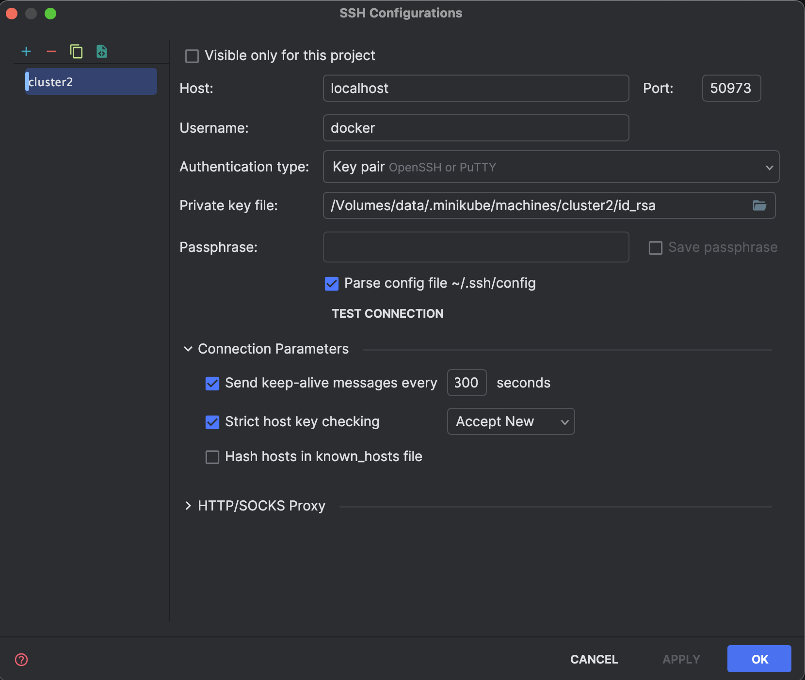
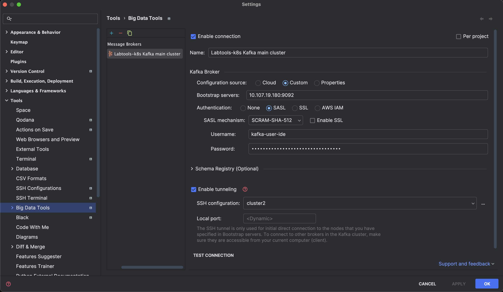

```shell
minikube ssh-key
```
```text
/Volumes/data/.minikube/machines/cluster2/id_rsa
```

```shell
docker ps
```

```text
CONTAINER ID   IMAGE                                 COMMAND                  CREATED        STATUS       PORTS                                                                                                                                  NAMES
6c5cb8b5cb58   gcr.io/k8s-minikube/kicbase:v0.0.42   "/usr/local/bin/entr…"   31 hours ago   Up 3 hours   127.0.0.1:50909->22/tcp, 127.0.0.1:50910->2376/tcp, 127.0.0.1:50912->5000/tcp, 127.0.0.1:50913->8443/tcp, 127.0.0.1:50911->32443/tcp   cluster1
0b47a96c128d   gcr.io/k8s-minikube/kicbase:v0.0.42   "/usr/local/bin/entr…"   31 hours ago   Up 2 hours   127.0.0.1:51181->22/tcp, 127.0.0.1:51182->2376/tcp, 127.0.0.1:51184->5000/tcp, 127.0.0.1:51180->8443/tcp, 127.0.0.1:51183->32443/tcp   cluster2-m04
3d960c59475f   gcr.io/k8s-minikube/kicbase:v0.0.42   "/usr/local/bin/entr…"   31 hours ago   Up 3 hours   127.0.0.1:51131->22/tcp, 127.0.0.1:51132->2376/tcp, 127.0.0.1:51134->5000/tcp, 127.0.0.1:51135->8443/tcp, 127.0.0.1:51133->32443/tcp   cluster2-m03
3f1cd83e5238   gcr.io/k8s-minikube/kicbase:v0.0.42   "/usr/local/bin/entr…"   31 hours ago   Up 3 hours   127.0.0.1:51105->22/tcp, 127.0.0.1:51106->2376/tcp, 127.0.0.1:51103->5000/tcp, 127.0.0.1:51104->8443/tcp, 127.0.0.1:51107->32443/tcp   cluster2-m02
2f92aaf63b26   gcr.io/k8s-minikube/kicbase:v0.0.42   "/usr/local/bin/entr…"   31 hours ago   Up 3 hours   127.0.0.1:50973->22/tcp, 127.0.0.1:50969->2376/tcp, 127.0.0.1:50971->5000/tcp, 127.0.0.1:50972->8443/tcp, 127.0.0.1:50970->32443/tcp   cluster2
```

cluster2: 127.0.0.1:50973->22/tcp



   * https://github.com/rogeriomm/labtools-k8s/blob/master/k8s/cluster2/base/kafka/main/user-ide.yaml

```shell
kubectl -n kafka-main-cluster get secret kafka-user-ide -o yaml | yq
```

```shell
kubectl get secret kafka-user-ide -n kafka-main-cluster -o=jsonpath='{.data.password}' | base64 --decode
```
```text
Qix9BAu3sVYifqASpt97gTxwlrspoNe0
```

```shell
 kubectl -n kafka-main-cluster get service main-kafka-bootstrap
```

```text
NAME                   TYPE        CLUSTER-IP      EXTERNAL-IP   PORT(S)                      AGE
main-kafka-bootstrap   ClusterIP   10.107.19.180   <none>        9091/TCP,9092/TCP,9093/TCP   30h
```



