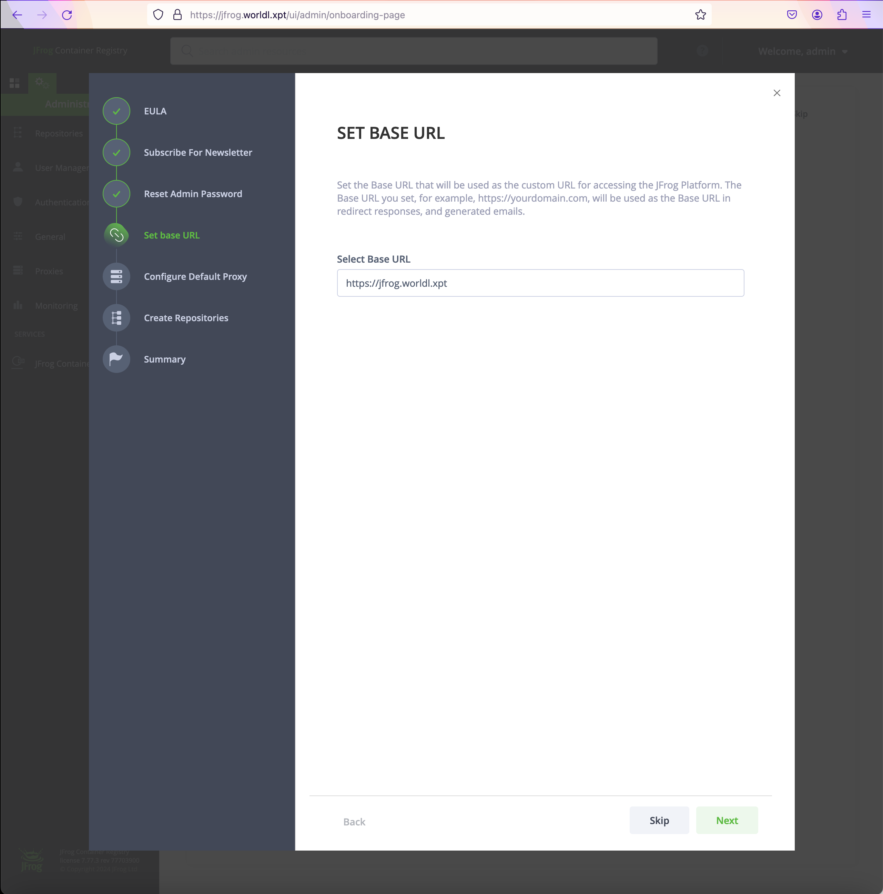
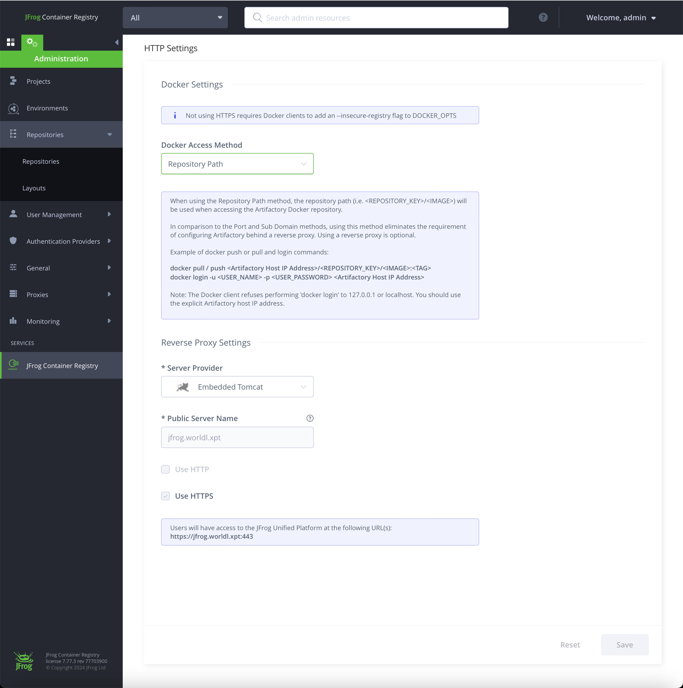
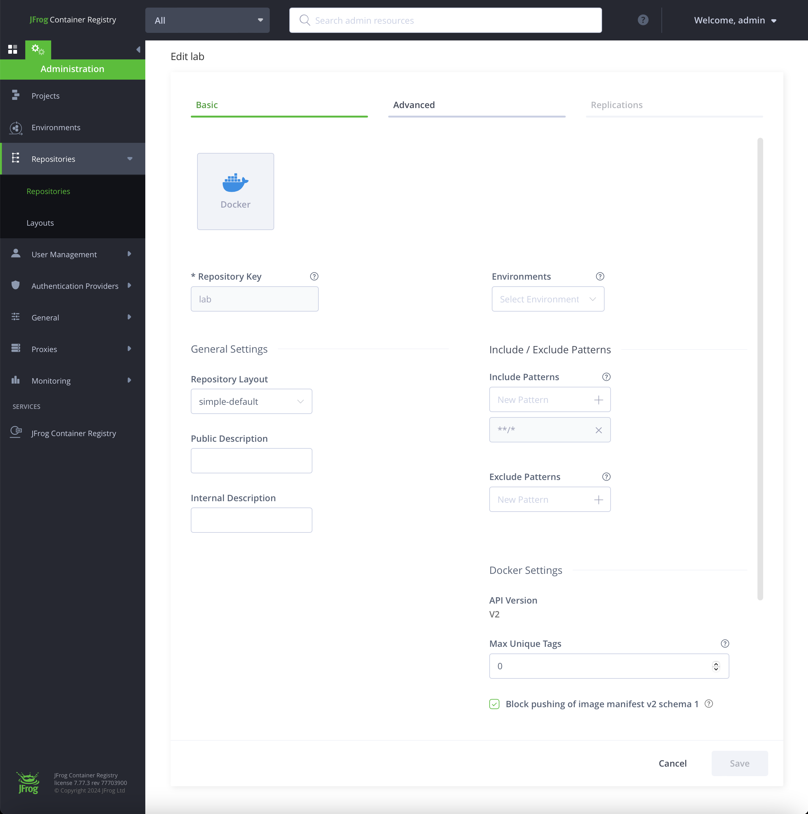
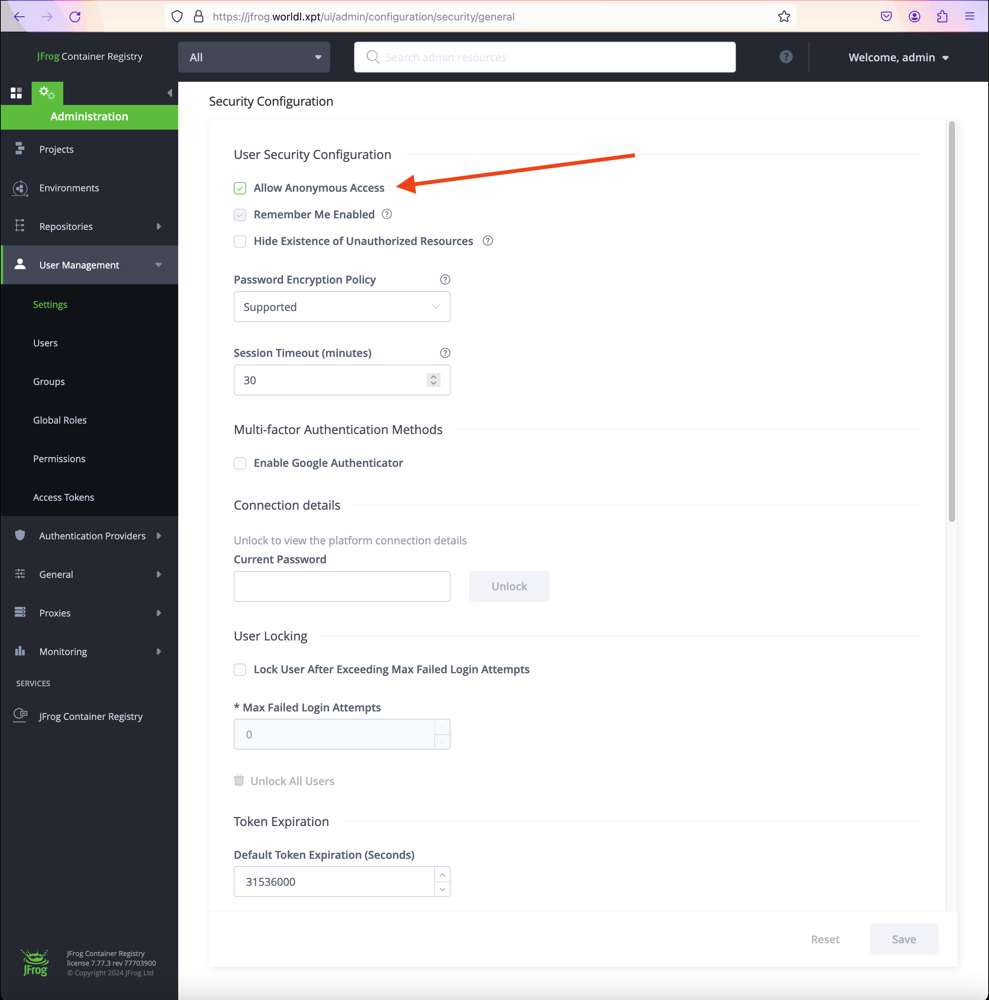

   * https://github.com/jfrog/charts

```shell
helm search repo jfrog
```

```text
NAME                            CHART VERSION   APP VERSION     DESCRIPTION                                       
jfrog/jfrog-common              0.0.7           0.0.7           A Library Helm Chart for grouping common logic ...
jfrog/jfrog-platform            10.17.0         7.77.3          The Helm chart for JFrog Platform (Universal, h...
jfrog/jfrog-registry-operator   1.0.0           1.0.0           JFrog Registry Operator to manage JFrog applica...
jfrog/artifactory               107.77.3        7.77.3          Universal Repository Manager supporting all maj...
jfrog/artifactory-cpp-ce        107.77.3        7.77.3          JFrog Artifactory CE for C++                      
jfrog/artifactory-ha            107.77.3        7.77.3          Universal Repository Manager supporting all maj...
jfrog/artifactory-jcr           107.77.3        7.77.3          JFrog Container Registry                          
jfrog/artifactory-oss           107.77.3        7.77.3          JFrog Artifactory OSS                             
jfrog/common                    0.0.4           0.0.4           A Library Helm Chart for grouping common logic ...
jfrog/distribution              102.22.1        2.22.1          A Helm chart for JFrog Distribution               
jfrog/helm-hub-sync             0.1.3           0.1.3           DEPRECATED - helm-hub-sync Helm chart             
jfrog/ingress-nginx             4.5.2           1.6.4           Ingress controller for Kubernetes using NGINX a...
jfrog/insight                   101.16.6        1.16.6          A Helm chart for JFrog Insights                   
jfrog/kubexray                  0.4.1           0.1.5           DEPRECATED - KubeXray Helm chart                  
jfrog/mission-control           104.7.16        4.7.16          A Helm chart for JFrog Mission Control            
jfrog/nginx                     15.1.5          1.25.2          NGINX Open Source is a web server that can be a...
jfrog/pdn-node                  101.9.1         1.9.1           Universal Repository Manager supporting all maj...
jfrog/pdn-server                101.9.1         1.9.1           Universal Repository Manager supporting all maj...
jfrog/pipelines                 101.53.4        1.53.4          A Helm chart for JFrog Pipelines                  
jfrog/postgresql                13.1.0          16.0.0          PostgreSQL (Postgres) is an open source object-...
jfrog/rabbitmq                  12.5.4          3.12.10         RabbitMQ is an open source general-purpose mess...
jfrog/redis                     17.13.2         7.0.12          Redis(R) is an open source, advanced key-value ...
jfrog/runtime-sensors           100.7.0         0.7.0           Helm chart for the deployment of JFrog Runtime ...
jfrog/vault                     0.25.0          1.14.0          Official HashiCorp Vault Chart                    
jfrog/xray                      103.88.10       3.88.10         Universal component scan for security and licen...
```

   * https://artifacthub.io/packages/helm/jfrog/artifactory-jcr
      * https://github.com/jfrog/charts/tree/master/stable/artifactory-jcr#chart-details
         *  "Optionally expose Artifactory with Ingress documentation"

```shell
docker login jfrog.worldl.xpt
```

```shell
docker pull hello-world
docker image tag hello-world jfrog.worldl.xpt/lab/hello-world
docker push jfrog.worldl.xpt/lab/hello-world
```

   * https://github.com/rogeriomm/labtools-k8s-notebooks/blob/master/jupyter-notebooks/quick-start/jfrog/jfrog.ipynb

# Troubleshooting

```html
<head><title>413 Request Entity Too Large</title></head>
<body>
<center><h1>413 Request Entity Too Large</h1></center>
<hr><center>nginx</center>
</body>
</html>
```
 See K8S NGINX ingress configuration
 
```shell
kubectl get pods -n ingress-nginx
```
   * https://stackoverflow.com/questions/49918313/413-error-with-kubernetes-and-nginx-ingress-controller: 413 error with Kubernetes and Nginx ingress controller

# Initial configuration
```shell
kubectl -n jfrog port-forward pod/jfrog-artifactory-jcr-0 8082:8082
```

   * http://localhost:8082
      * Base URL: https://jfrog.worldl.xpt 
      * Add repository "lab"






# JFrog API
   * List repositories
```shell
curl -u admin:password "http://jfrog.worldl.xpt/artifactory/api/repositories" | jq
```
   * Create repository. This REST API is available only in Artifactory Pro
```shell
curl -uadmin:password -X PUT "http://jfrog.worldl.xpt/artifactory/api/repositories/lab" -H "Content-Type: application/json" -d '{
  "key": "lab",
  "rclass": "local",
  "packageType": "docker",
  "dockerApiVersion": "V2",
  "description": "A Docker repository",
  "notes": "Docker repository for lab",
  "includesPattern": "**/*",
  "excludesPattern": "",
  "repoLayoutRef": "simple-default",
  "dockerRepositoryVersion": "V2",
  "maxUniqueTags": 0,
  "propertySets": [],
  "archiveBrowsingEnabled": false,
  "optionalIndexCompressionFormats": [],
  "dockerTagRetention": 0,
  "dockerTagRetentionMaxDays": 0,
  "dockerTagRetentionSchedule": "",
  "blockPushingSchema1": true
}'
```
