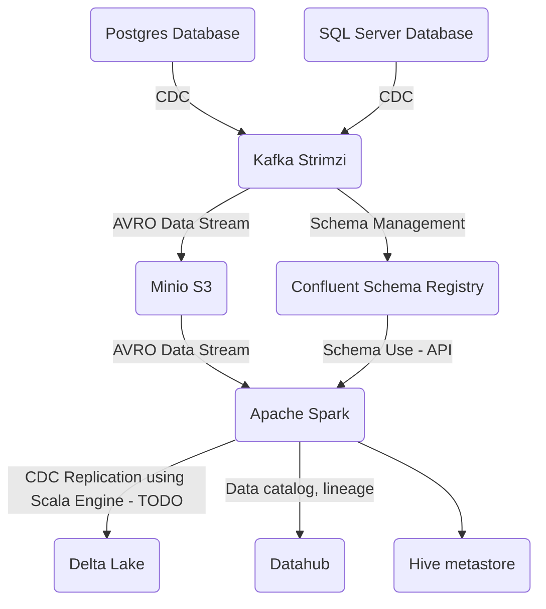

```mermaid
flowchart TD
    Postgres(Postgres Database) -->|CDC| Kafka(Kafka Strimzi)
    SQLServer(SQL Server Database) -->|CDC| Kafka
    Kafka -->|AVRO Data Stream| ConsumerMinio(Minio S3)
    ConsumerMinio -->|AVRO Data Stream| ConsumerSpark(Apache Spark)
    ConsumerSpark --> |CDC Replication using Scala Engine - TODO| ConsumerDelta(Delta Lake)
    ConsumerSpark --> |Data catalog, lineage| ConsumerDatahub(Datahub)
    ConsumerSpark --> HiveMetastore(Hive metastore)
    Kafka -->|Schema Management| SchemaRegistry(Confluent Schema Registry)
    SchemaRegistry -->|Schema Use - API| ConsumerSpark
    click ConsumerDelta href "https://github.com/rogeriomm/debezium-cdc-replication-delta" "Visit GitHub repository"

    
    class Postgres,SQLServer database;
    class Kafka,SchemaRegistry kafka;
    class ConsumerMinio,ConsumerSpark,ConsumerDelta consumers;
    class Datahub datahub;
```

   * [CDC replication on Delta lake](https://github.com/rogeriomm/debezium-cdc-replication-delta)

